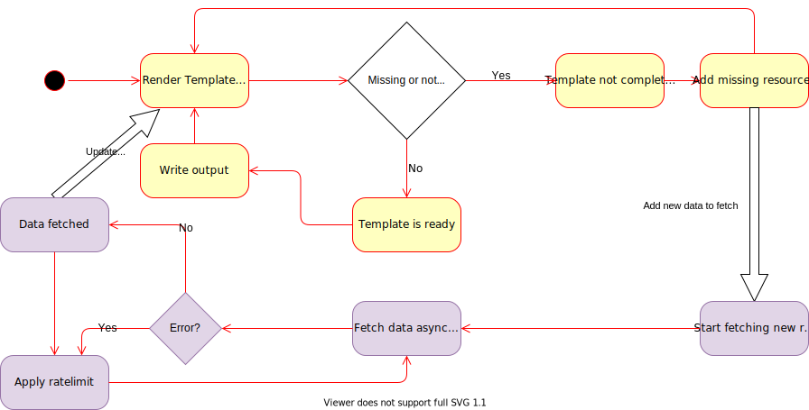

# consul-templaterb Internal Architecture Overview

## Consul basics

`consul-templaterb` is a ruby library (or `GEM`) with a single binary that does render `.erb` files based on Consul exposed endpoints.

Consul is a kind of distributed K/V tree store that exposes most of his APIs using HTTP endpoints with a way to watch for changes based on an Index. Each part of the Consul Tree has its own Index reflecting the last id of transaction for this
part of the tree. It means that Consul has a kind of transaction ID for each subtree of the data.

Consul also exposes some specific endpoints to get some discovery specific endpoints (eg: `/v1/catalog/services` to get
the list of services registered in the cluster).

For each endpoint, `consul-templaterb` performs a watch by getting information about the last transaction on this endpoints, storing it locally and watching at Consul to get updates about the data within this endpoint.

## How it works

There is a loop in the engine, every second, all templates are rendered using the `ERB` template engine.

Each template is assigned to a `ConsulTemplateRender` object that keeps tracks of changes on disk of template (in order
to be able to hot-reload templates) as well as monitoring if the template is completely rendered, aka all data from
Consul is properly retrieved and consistent.

At each rendering, each template using a Consul Endpoint (for instance, calling `datacenters()`) does register itself
in `EndPointsManager`. If the endpoint is already registered, fetch the result if available and return the value, if not,
the endpoint is tagged as dirty. When the rendering of a template is completed, a check is performed to see if some endpoints used by the template are still marked as dirty. Being dirty means that some data from Consul is missing, so
that the result is not the definitive one. If no endpoint is dirty, then the result of template can be rendered on disk
and template is complete.

At startup, in order to converge faster, templates are rendered more quickly that every 1s to speed up startup time for first convergence, meaning that the delay between each rendering of template might be very fast, especially at startup (so, DO NOT USE Ruby I/O in templates unless you really know what you are doing)

### EndPointsManager

`EndPointsManager` is the object responsible of keeping track the endpoints (basically the I/O) of the whole library.
When a new Consul endpoint is added by a template, it is registered in that object. Each time a template is rendered,
all the endpoints are marked as used. When some endpoints are not used for a while (a few rendering loops), the 
`EndPointsManager` will garbage collect those endpoints.

### ConsulTemplateEngine

When `consul-templaterb` starts, it creates an [ConsulTemplateEngine](lib/consul/async/consul_template_engine.rb) that
aggregates all options, template files and parameters. The engine then starts a loop running every second (this can be changed) that:
 * perform a rendering of each of the `.erb` template files using a `ConsulTemplateRender` object
 * when all template are rendered the first time, will start some program(s) if specified (the `--exec` parameters)
 
### ConsulTemplateRender

This object keeps track of template, its last state (rendered or not), and whether the file template needs to be reloaded (aka if file has been modified on filesystem).