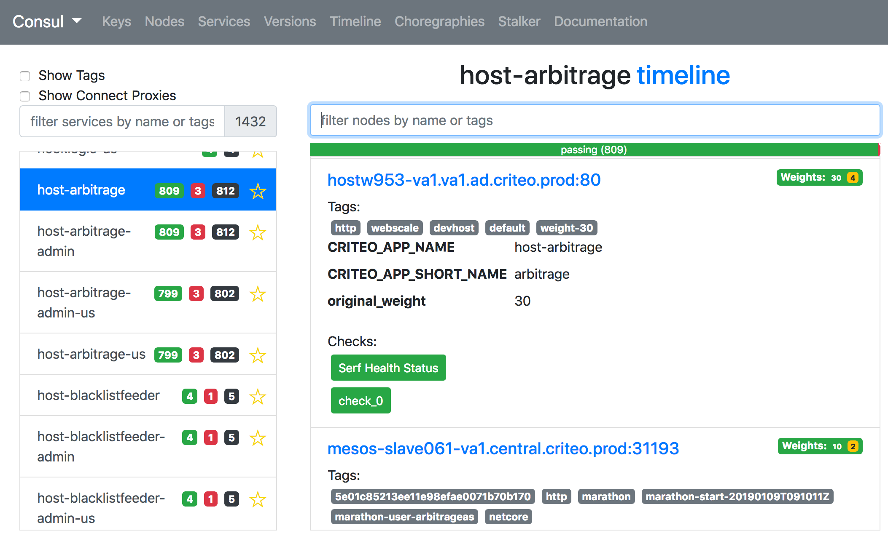

# consul-templaterb

[](https://travis-ci.org/criteo/consul-templaterb)
[](http://github.com/criteo/consul-templaterb/releases)
[](#license)

The ruby GEM [consul-templaterb](https://rubygems.org/gems/consul-templaterb)
is both a library and an executable that allows generating files
using data from Consul (Discovery and Key/Value Store) easily using ruby's
[ERB](https://en.wikipedia.org/wiki/ERuby) templates.
It also supports launching programs and babysitting processes
when rendering the files, thus notifying programs when data do change.

It is intended for the users accustomed to expressiveness or Ruby templating,
allowing for more flexibility and features than Go templates.

It also allows using all of the Ruby language, especially useful for generating
files in several formats ([JSON](samples/consul_template.json.erb),
[XML](samples/consul_template.xml.erb)) for which text substitutions are hard
to get right (escaping, attributes encoding...).

It also focuses on providing good performance and lightweight usage of bandwidth,
especially for very large clusters and watching lots of services.

For the rendering of complex templates in large Consul Clusters, it usually
renders faster with a more predictable way the template than the original
consul-template.

It provides a very [simple API](TemplateAPI.md) to write your templates
with fully [working examples](samples/).

It also allows displaying a very nice and hi-performance HTML5 UI for Consul,
see [consul-ui](samples/consul-ui) for details.

## Video introduction to consul-templaterb

[](https://youtu.be/zLzrLGLLl4Q)

## Differences with HashiCorp's consul-template

[Hashicorp's Consul Template](https://github.com/hashicorp/consul-template)
inspired strongly the creation of this GEM and this executable wants
to achieve better results in some use cases, especially for very large
Consul clusters with many nodes and servers.

Consul Template uses Go templates which is very limited in its set of
features: it is complicated to sort, apply real transformations
using code and even interact with the OS (ex: get the current date, format
timestamps...).

The sort feature for instances allow you to create a predictable output (i.e: meaning
that the order of nodes is predictable), thus it might offer better performance
since the reload of processes if happening ONLY when the files are binary
different. Thus, if using consul-templaterb, you will reload less your HAProxy or
load-balancer than you would do with consul-template.

Compared to consul-template, consul-templaterb offers the following features:

* Hot-Reload of template files
* Bandwidth limitation per endpoint (will soon support dynamic bandwidth limiter)
* Supports launch and supervision of multiple child processes
* Supports launching commands when files do change on disk (reload commands...)
* Supports all Ruby features (ex: base64, real JSON/XML generation...)
* Information about bandwidth

The executable supports semantics and command-line flags and options similar to
HashiCorp's Consul-template, so many flags you might use in consul-template will
work in a similar way. It also supports the same environment variable
`CONSUL_HTTP_ADDR` to find the Consul Agent to query and `CONSUL_HTTP_TOKEN` to
get the token.

## Installation

You might either use the executable directly OR use this GEM as a library by
adding this line to your application's `Gemfile`:

```ruby
gem 'consul-templaterb'
```

And then execute:

```shell
$ bundle
[...]
```

Or install it yourself as:

```shell
$ gem install consul-templaterb
[...]
```

If you simply want to use the executable on your preferred Linux distribution, you
have to install first: `ruby` and `ruby-dev`.

### Quick install on Ubuntu-Linux

```shell
sudo apt-get install ruby ruby-dev && sudo gem install consul-templaterb
```

You can now use it directly using the binary `consul-templaterb` in your path.

### Quick install on Windows

On Windows, a bug exists with Ruby greater than 2.4.

To make it work, use this command as explained in
https://github.com/oneclick/rubyinstaller2/issues/96#issuecomment-434619796

```
gem install eventmachine consul-templaterb --platform ruby
```

### Run it with Docker

A Docker image is also available https://hub.docker.com/r/discoverycriteo/consul-templaterb
and allows to quickly have a working
[Consul-UI](https://github.com/criteo/consul-templaterb/blob/master/samples/consul-ui/README.md)
that will serve the UI to explore your Consul Cluster.

### Playing with the samples templates

Samples are installed with the GEM, you can either
[download](https://github.com/criteo/consul-templaterb/tree/master/samples) them or
simply use the ones installed with the gem. To figure out where the templates are
installed:

```shell
$ gem contents consul-templaterb|grep samples
[...]
```

Will output the path where the samples are being installed, you can copy the directory
somewhere and then issue the command:

```shell
$ consul-templaterb samples/*.html.erb
Using samples/checks.html output for samples/checks.html.erb
[...]
```

It will render a full web site you may browse to look in real-time the status of your
Consul Cluster.

You can now have a look to the [API Documentation](TemplateAPI.md) to modify existing
templates or write your owns, it is very easy!

## Usage of consul-templaterb

### Show help

```shell
$ consul-templaterb --help
USAGE: consul-templaterb [[options]]
    -h, --help                       Show help
    -v, --version                    Show Version
        --retry, --consul-retry-attempts [RETRIES]
                                     If consul fails after n retries, stop the program, default=10
    -f, --[no-]fail-fast             If consul/vault endpoints fail at startup, fail immediately
    -g, --no-gzip-compression        Disable GZIP compression in HTTP requests
    -c, --consul-addr=<address>      Address of Consul, eg: http://localhost:8500
    -l, --log-level=<log_level>      Log level, default=info, any of none|error|info|debug
        --consul-token=<token>       Use a token to connect to Consul
    -V, --vault-addr=<address>       Address of Vault, eg: http://localhost:8200
        --vault-token=<token>        Token used to authenticate against vault.
        --[no-]vault-renew           Control auto-renewal of the Vault token. Default: activated
        --vault-retry, --vault-retry-attempts [RETRIES]
                                     If vault fails after n retries, stop the program, default=10
        --vault-lease-duration-factor=<factor>
                                     Wait at least <factor> * lease time before updating a Vault secret. Default: 0.5
    -w, --wait=<min_duration>        Wait at least n seconds before each template generation
    -r, --retry-delay=<min_duration> Min Retry delay on Error/Missing Consul Index
    -k, --hot-reload=<behavior>      Control hot reload behaviour, one of :[die (kill daemon on hot reload failure), keep (on error, keep running), disable (hot reload disabled)]
    -K, --sig-term=kill_signal       Signal to send to next --exec command on kill, default=TERM
    -T, --trim-mode=trim_mode        ERB Trim mode to use (- by default)
    -R, --sig-reload=reload_signal   Signal to send to next --exec command on reload (NONE supported), default=HUP
    -M, --debug-memory-usage         Display messages when RAM grows
    -e, --exec=<command>             Execute the following command
    -d, --debug-network-usage        Debug the network usage
    -t erb_file:[output]:[command]:[params_file],
        --template                   Add a erb template, its output and optional reload command
    -o, --once                       Do not run the process as a daemon
```

When launched with file arguments ending with .erb, the executable will assume
the file is a template and will render the corresponding file without the
`.erb` extension.

It means that you can call consul-templaterb with `*.erb` arguments, the shell
will then substitute all files and render it by removing the `.erb` extension as
if the `--template my_file.ext.erb:myfile.ext` was used.

### Generate multiple templates

In the same way as consul-template, consul-templaterb supports multiple templates and executing
commands when the files do change. The parameter `--template <ERB>:<DEST>:[reload_command]:params_file` works
in the following way:

* ERB: the ERB file to use as a template
* DEST: the destination file
* reload_command: optional shell command executed whenever the file has been modified
* params_file: JSON or YAML file to load and to use as parameter for the template (see
  [param() function](TemplateAPI.md#paramparameter_name-default_value-nil) to retrieve
  the values)

The argument can be specified multiple times, ex:

Example of usage:

```shell
$ consul-templaterb \\
  --template "samples/ha_proxy.cfg.erb:/opt/haproxy/etc/haproxy.cfg:sudo service haproxy reload"
  --template "samples/consul_template.erb:consul-summary.txt"
```

### Process management and signalization of configuration files

With the `--exec` argument (can be specified multiple times), consul-templaterb will launch
the process specified when all templates have been generated. When generated file(s) do change,
a POSIX signal (HUP by default) is sent to the spawned process. If you generate several files
at the same time, the signal will be sent only once the rendering of all templates is completed,
so if your process is using several configuration files, all files will be modified and
consistent before the signal is sent to process.

If any template does return nothing (aka use `return nil` in the code of a template),
consul-templaterb does consider that the template is not ready and will not launch the executable
nor write the file.

Signals can be customized per process. Two signals are supported with options `--sig-reload` and
`--sig-term`. When the option is added, the next `--exec` options to start a process will use the
given signal. By default, HUP will be sent to reload events (you can use NONE to avoid sending any
reload signal), TERM will be used when leaving consul-templaterb.

### Bandwidth limitation

This is actually the original reason for the creation of this GEM: on Criteo's large clusters,
consul-template generated several hundreds of Mb/s to the Consul-Agent which also
generated several hundreds of Mb/s with the Consul servers.

By design, the GEM supports limiting the number of requests per endpoints (see code in
`bin/consul-templaterb` file). It avoids using too much network to fetch data from Consul
in large Consul Clusters (especially when watching lots of files).

The limitation is static for now, but fair dynamic bandwidth allocation will allow limiting
the bandwidth used to get information for all services by capping the global bandwidth used
by consul-templaterb.

### Samples

Have a look into the [samples/](samples/) directory to browse example files which contains those
examples:

1. [List all nodes on Cluster](samples/consul-ui/consul_nodes.json.erb)
2. [Show all services in Cluster](samples/consul-ui/consul_services.json.erb)
3. [Show all Key/Values nicely](samples/consul-ui/consul_keys.json.erb)
4. [Services in XML](samples/consul_template.xml.erb)
5. [Services in JSON or YAML](samples/consul_template.json.erb)
6. [Generate HAProxy Configuration](samples/ha_proxy.cfg.erb)
7. [Export Consul Statistics to Prometheus](samples/metrics.erb): count all services, their state,
   datacenters and nodes and export it to Prometheus easily to trigger alerts.
8. [List all services/Nodes with their statuses for all datacenters](samples/all_services.txt.erb)
9. [Show all services/instances not passing on all DCs](samples/tools/find_all_failing_services.txt.erb)
10. [List all RubyGems consul versions from remote server JSON](samples/list_ruby_versions_from_rubygems.txt.erb)

If you want to test it quickly, you might try with (assuming your consul agent is listening on
`http://localhost:8500`):

```shell
$ be bin/consul-templaterb -c 'http://localhost:8500' samples/*.html.erb
[...]
```

It will generate a full website in samples/ directory with lots of Consul information ready to
use (website updated automagically when values to change).

All templates are validated using the Travis CI, so all should be working for your Consul
Configuration.

### Structured text generation (YAML, JSON, XML...)

Since ERB supports real language features, we recommend you to use Hashes or Arrays in Ruby and
at the end to generate the output. It allows changing very quickly from JSON to YAML or XML and
avoiding all the pitfalls of structured language serialization (such as escaping attributes or
indentation).

See [Services in JSON or YAML](samples/consul_template.json.erb) to look at a working example.

## Template development

Please look at [the template API](TemplateAPI.md) to have a list of all functions you might use for your
templates. Don't forget to have a look at the [samples/](samples/) directory to have full working examples.

## Development

### Quick start

We recommend using bundle using `bundle install`, you can now run `bundle exec bin/consul-templaterb`.
Help is available running `bundle exec bin/consul-templaterb --help`

The following example will generate static HTML pages and JSON data for `consul-ui`:
```
bundle exec bin/consul-templaterb -c your.consul.agent:8500 samples/consul-ui/*.erb
```

If you need remote calls, you need an HTTP server. A simple way to have one is using Python's simple HTTP
server. Example for `consul-ui`:
```
cd samples/consul-ui
python -m SimpleHTTPServer
```

### Installation

To install this gem onto your local machine, run `bundle exec rake install`. To release a new version, update the
version number in `version.rb`, and then run `bundle exec rake release`, which will create a git tag for the version,
push git commits and tags, and push the `.gem` file to [rubygems.org](https://rubygems.org/gems/consul-templaterb).

## Known bugs

Here are the known bugs of the application:

* [ ] `render_file` might create an infinite recursion if a template includes itself indirectly.
* [ ] On Windows, the consul-templaterb cannot work with more than 2048 endpoints watched (see https://github.com/oneclick/rubyinstaller/issues/104#issuecomment-7681074)

Please consult [CHANGELOG.md](CHANGELOG.md) for fixed bugs.

## TODO

* [x] Hashi's Vault support (EXPERIMENTAL)
* [ ] Implement automatic dynamic rate limit
* [x] More samples: apache, nginx, a full website displaying consul information...
* [x] Optimize rendering speed at start-up: an iteration is done every second by default, but it would be possible to speed
      up rendering by iterating with higher frequency until the first write of result has been performed.
* [ ] Allow tuning bandwidth using a simple configuration file (while it should not be necessary for 90% of use-cases)

## Contributing

See [CONTRIBUTING.md](CONTRIBUTING.md) for guidance: Bug reports and pull requests are welcome on GitHub at https://github.com/criteo/consul-templaterb.

This project is intended to be a safe, welcoming space for collaboration, and contributors are expected to adhere to the
[Contributor Covenant](http://contributor-covenant.org) code of conduct. See [CODE_OF_CONDUCT.md](CODE_OF_CONDUCT.md)

## License

The gem is available as Open-Source under the terms of the Apache v2 license. See [LICENSE.txt](LICENSE.txt) file.
