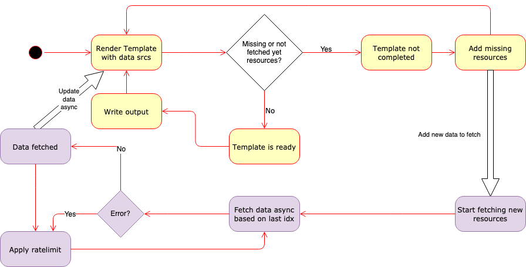

# Template-based discovery with consul-templaterb

Source of article https://medium.com/criteo-labs/template-based-discovery-with-consul-templaterb-8ff88434c457

# How and why Criteo built a template-based system for Consul

[consul-templaterb](https://github.com/criteo/consul-templaterb/) is an OpenSource Software (OSS) written in Ruby that allows you to very quickly create UIs for Consul or configuration files for your beloved software to interact with Consul. This article describes why we wrote it and why you might be interested in using it.

# The context

At the end of 2017, Consul started becoming a very important piece in Criteo’s infrastructure as it was responsible for dealing with the discovery of all major business applications at Criteo. At that time, Criteo had more than 25,000 servers on production and some datacenters had more than 5,000 agents per datacenter. At the same time, we started building our Load-Balancer stack based on the Consul state. So it became more and more important to make it efficient, stable and expand it with new features.

Criteo wanted to move towards HAProxy for its load-balancing stack, thus we started generating some configuration for HAProxy with all HTTP services with the template-based configuration generator consul-template. However, things were a bit more complicated than expected because the program consul-template was using almost all bandwidth available just to discover all services. Moreover, the system was constantly updating HAProxy configuration.

As explained in our first article “[Discovery with Consul at scale](https://medium.com/criteo-labs/discovery-with-consul-at-scale-1d6808202d86)”, Consul includes a notification system to ensure your systems are always up-to-date with the content of the discovery. When this system starts to push too many notifications, on large services, the amount of data sent to all agents can be quite impressive (several megabytes/s for a single service having hundreds of instances).

Thus, we started investigating the issue and figured out that it was linked to a race condition in large clusters that caused all listeners of Consul to be notified continuously. This issue was eventually solved by our [Pull-Request #3899](https://github.com/hashicorp/consul/pull/3899) (and quite a few others after that), but the investigation showed that it was quite hard to investigate the root cause of such issues.

Therefore, I started a simple tool to watch all the services matching some patterns and report the bandwidth usage, but I also wanted to prove it would be possible to generate all configurations for HAProxy with an optimized tool, thus having a templating mechanism. The [Pull Request #1066](https://github.com/hashicorp/consul-template/pull/1066) to fix the issue on the consul-template itself was not yet considered (and it was hard to have something better), so I decided to implement it in Ruby with asynchronous I/Os (Input/Outputs) because I was very frustrated by the Go templating language used in consul-template and was in love with ERB templates.

# The goals

From scratch, I wanted to take the various shortcoming of consul-template into account:

* The ability to generate high-level code to generate various formats (YAML, JSON, XML): it is dangerous, error-prone and painful to generate JSON or XML content using text templating. People fighting with YAML indentation will tell you that.
* The ability to use a Turing complete and effective language to perform simple transformation such as sorting (Consul by default has some rules to sort the output, but it might not be predictable, for instance, based on the round-trip between servers).
* Being able to push real-life optimizations (for instance, we don’t care about being notified immediately when a change occurs, we want to be notified once before dumping the configuration file, not 100 times without taking it into account), based on the type of query performed.
* Being able to scale nicely with Consul and avoid overloading the cluster for nothing in case of bug (for instance, we use a penalty for services changing too much, we rate-limit the notifications).
* Being very simple to use, hiding all the complexity to the template creator and using optimizations to reduce the number of calls to Consul, meaning being as purely functional as possible by hiding all I/O operations and taking decisions based on our experience with Consul internals.
* Be evolutive: When some functions or fields are missing in a consul-template, you have to do a pull request on consul-template to add your new fields/methods, then you can work. It would be nice if any field of endpoints would be supported natively (so new versions of Consul can be used with an old version of our tool).
* Support for hot-reload of templates, and nice error messages with the precise line when an error occurs, so writing templates should be very fast and efficient.
* Have most of the consul-template features including babysitting of processes, spawn commands when files do change…

# Internals: make your template engine in Ruby

## At startup

The engine collects all template sources and computes the destinations. Each template and its destination also register some commands to run when the destination does change. Those objects save the last time the template has been read (to allow hot-reload) and the last binary content associated with them (to detect binary changes).

## The main loop

First, the main loop is working on pending events. Those events are in fact the processing of the I/O operations querying the Consul agent. But every second by default, the main loop also evaluates templates which are Ruby code. When this is just regular code, this is evaluated normally, but when the code called is part of the [I/O API](https://github.com/criteo/consul-templaterb/blob/master/TemplateAPI.md), the code does the following:

1. Checks in a registry if this method has been called with the same parameters, if not, create it, mark it as dirty (so the registry knows we are waiting for data from Consul), launch the request asynchronously to Consul, store it in the registry. This will be translated into events that will be run as events in the main loop.
2. Return the object stored within the registry. By default, this object returns the empty object or collection according to its type. When the request finally gets a response from Consul, the object is marked as “non-dirty” and the result is put within the registry, so the next evaluation returns the content of the requests.

Once all code has been evaluated and the result has been stored in memory, the main loop checks whether the template is using “dirty” objects in the registry. Having at least one dirty object means that some requests are still in flight and we don’t have the result yet, so basically means the template, while evaluated, has been evaluated with fake (empty) data and is not yet ready.

However, if the template is not using any dirty object it means we did receive all the data and we can render the template on disk. We first check if our last rendering was different. If the new rendering phase was not different, nothing did change, however, if the data rendered is different, the file is stored to disk and commands might be evaluated (to notify a program to reload for instance).

All the I/O are done asynchronously (using [eventmachine](https://github.com/eventmachine/eventmachine)) but performed within the main loop, the one also performing the rendering, so, there is no possibility of threading issues.

## Handling of I/O

The Input/Outputs are handled very carefully with regards to what we explained in our previous article “[Be a good Consul client](https://medium.com/criteo-labs/be-a-good-consul-client-5b55160cff7d)” and adds a few tricks:

* When a given endpoint is changing too fast with any real change (the data is the same as last call), a penalty is applied, so the endpoint won’t be queried before a few seconds (this allows to work well even with old Consul versions with patch [#3899](https://github.com/hashicorp/consul/pull/3899)).
* Some endpoints [are configured specifically](https://github.com/criteo/consul-templaterb/blob/master/bin/consul-templaterb#L61) to avoid too many calls (for instance, we don’t consider we add a new DC every 30 seconds).
* Some specific behavior exists for non-existing service (was causing lots of issues with Prometheus for instance, see [Prometheus PR #3814](https://github.com/prometheus/prometheus/pull/3814)), so we will work on the old Consul version with our [PR #4810](https://github.com/hashicorp/consul/pull/4810).
* By default, when some errors occur, try to limit the number of calls to avoid increasing the pressure on the cluster.
* Collect statistics that can be used in your templates. For instance, the [Prometheus exporter uses it to know whether a service is unstable or not](https://github.com/criteo/consul-templaterb/blob/master/samples/metrics.erb#L88).

## The hard part about async I/Os with Ruby

This program was my first project dealing with complex code with important performance issues. I first discovered that Ruby async I/O code is really hard and most libraries are not dealing with it properly. Many libraries just lie (by creating threads and pretending to be async). The only library I found handling it correctly was [eventmachine](https://github.com/eventmachine/eventmachine/).

While the library is petty mature (the project is quite old, 9 years old), I had lots of issues very quickly. I spent quite some time making it work on my targeted operating systems (Linux, Mac OS, Windows).

* On Windows, installation is painful (see https://github.com/criteo/consul-templaterb/#quick-install-on-windows) and due to limitation into the Ruby runtime, it does not support more than 2048 file descriptors with native implementation (while this works with Linux Subsystem on Windows 10).
* On all Operating Systems, opening lots of HTTP connections concurrently led to crashes (see https://github.com/igrigorik/em-http-request/issues/315, [#604](https://github.com/eventmachine/eventmachine/issues/604), [#770](https://github.com/eventmachine/eventmachine/issues/770), and [#824](https://github.com/eventmachine/eventmachine/issues/824)) that took me lots of time to debug (including native C code debugging), quite frustrating for such mature library (the good news is that eventmachine is now fixed thanks to [consul-templaterb](https://github.com/criteo/consul-templaterb/)).

While those problems are now solved and you can use it properly, it took me weeks to solve.

Furthermore, the lack of HTTP/2 is a bit worrisome today as more and more systems allow it (it would avoid the lack of file descriptors on very large clusters).

## Some fun features

* All templates in the repository are unit tested for each release of consul-templaterb, so all samples are working on your local installation.
* You can generate lots of formats: [Services in XML](https://github.com/criteo/consul-templaterb/blob/master/samples/consul_template.xml.erb), [JSON](https://github.com/criteo/consul-templaterb/blob/master/samples/consul_template.json.erb), [YAML](https://github.com/criteo/consul-templaterb/blob/master/samples/consul_template.json.erb#L58) using Hash and just dumping in the right format!
* You can load templates from Consul Key/Value store, so you can change templates dynamically from Consul K/V Store (we use this feature in for our Prometheus configurations for instance as described in “[Mixing Observability with Service Discovery](https://medium.com/criteo-labs/mixing-observability-with-service-discovery-2bb8909e8530)”).
* You can also query Vault / some JSON APIs very easily.
* You can have a very high-performance UI (see [Consul-UI](https://github.com/criteo/consul-templaterb/tree/master/samples/consul-ui)) easily for your own use-cases. This UI is generated in real-time as static files and can be served by your favorite webserver (we do use nginx on our side), so it scales indefinitely if you have lots of users.
* Huge Performance gap with consul-template: in version 1.0 of Consul, consul-template was using 800Mb/s to scrape all services in one of large DCs, consul-templaterb is using less than 100kb/s (800x reduction!) to generate the full UI of Consul and fetch all services in our largest DC now.
* Good abstraction with impressive performance compared to other projects such as [consult](https://github.com/veracross/consult) (no need to deal with kind of “magic TTL”) or consul-template itself: the APIs are simpler, you have to deal less with Consul specific optimizations and the performance is better.

# Usages at Criteo (non-exhaustive)

We use this executable for many things at Criteo (see “Inversion of Control with Consul”):

* Automatic Alerting / Prometheus configuration
* [Consul-UI](https://github.com/criteo/consul-templaterb/tree/master/samples/consul-ui)s and its Consul Timeline (keep track of the history of all changes for all services)
* List of assets per DC/Racks
* Monitoring of services/racks
* Ownership enforcement
* Live generation of configuration for several programs/services

# Try it quickly

If you don’t want to bother configuring and tuning it, you can try it very quickly with our docker images: In 2 minutes (download included), you have a full scalable UI with Consul, serving static files with nginx and keeping a history of all changes on your services live.

# More on the subject

* The [consul-templaterb API](https://github.com/criteo/consul-templaterb/blob/master/TemplateAPI.md) to write templates, with links to real-world examples in the samples directory.
* [INTERNALS.md](../INTERNALS.md) on Github (describes the objects in the code)
* Slides at HashiConf ’19: “[Consul Templates on Steroids](https://fr.slideshare.net/PierreSouchay/2019-hashiconf-consultemplaterb)”
* A video introduction of consul-templaterb:

# Other articles from the Discovery team

* [Discovery with Consul at scale](https://medium.com/criteo-labs/discovery-with-consul-at-scale-1d6808202d86)
* [Be a good Consul client](https://medium.com/criteo-labs/be-a-good-consul-client-5b55160cff7d)
* [Anatomy of a bug: When Consul has too much to deliver for the big day](https://medium.com/criteo-labs/anatomy-of-a-bug-when-consul-has-too-much-to-deliver-for-the-big-day-4904d19a46a4)
* [Inversion of Control for the Infrastructure with Consul](https://medium.com/criteo-labs/inversion-of-control-for-the-infrastructure-with-consul-b894877b33a4)
* [Mixing Observability with Service Discovery](https://medium.com/criteo-labs/mixing-observability-with-service-discovery-2bb8909e8530)

Pierre Souchay, 2020-03-03
Also published on https://medium.com/criteo-labs/template-based-discovery-with-consul-templaterb-8ff88434c457